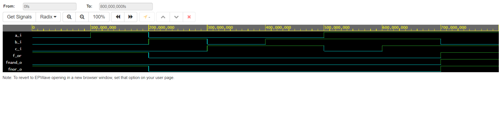
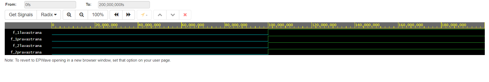

# Lab assignment

## 2
Listing of VHDL code design.vhd
 ```vhdl
architecture dataflow of gates is
begin
    f_or  <= ((not b_i) and a_i) or ((not c_i) and (not b_i));
    fnand_o <= (not (not ((not b_i) and a_i)) and (not (not c_i) and (not b_i)));
    fnor_o <= (not (b_i or (not a_i))) or (not (c_i or b_i));

end architecture dataflow;
```
Screenshot with simulated time waveforms

Link to your public EDA Playground example
(https://www.edaplayground.com/x/SpQi)

## 3
Listing of VHDL code design.vhd
 ```vhdl
architecture dataflow of gates is
begin
    f_1lavastrana  <= (x_i and y_i) or (x_i and z_i);
    f_1pravastrana <= x_i and (y_i or z_i);
    f_2lavastrana  <= (x_i or y_i) and (x_i or z_i);
    f_2pravastrana <= y_i or (y_i and z_i);

end architecture dataflow;

```
Screenshot with simulated time waveforms

Link to your public EDA Playground example
(https://www.edaplayground.com/x/RWrj#)
