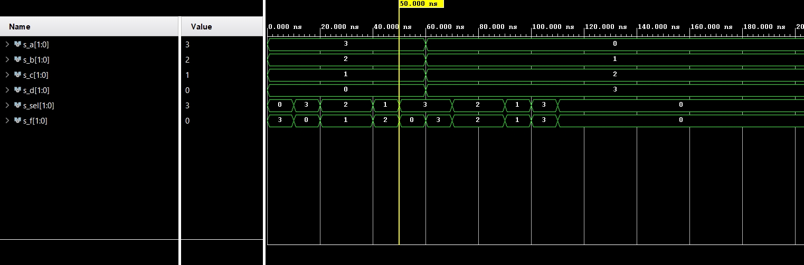
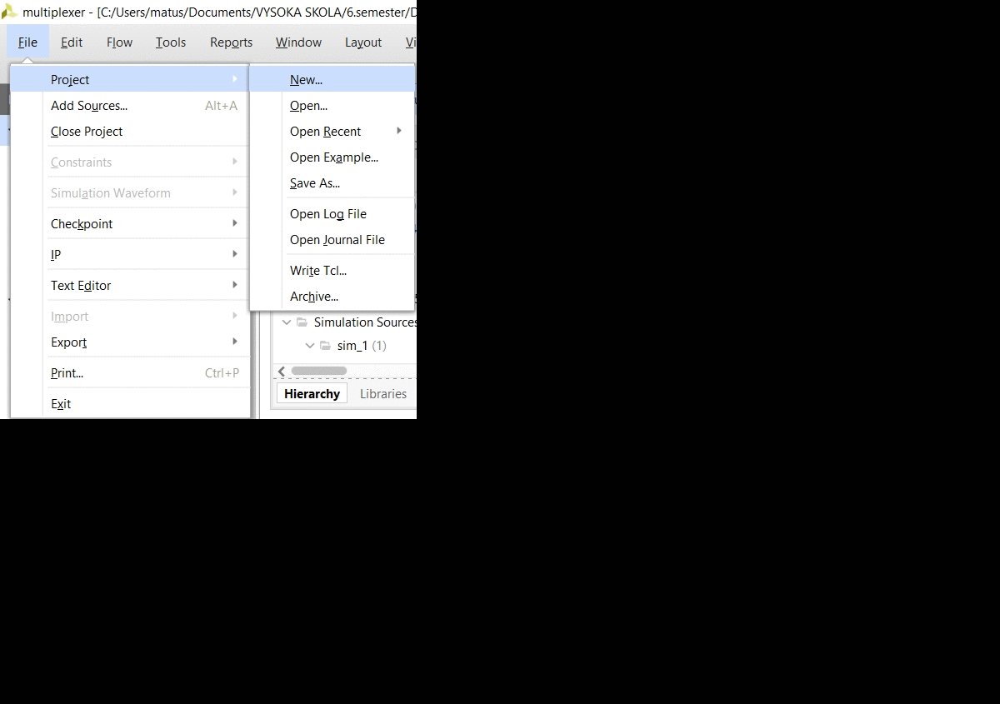

# Lab assignment


## 1 Preparation tasks 
| **Switch** | **PIN** | **LED**  | **PIN** |
| :--------: | :-----: | :--: | :-----: |
|     0      |   J15   |  0   |   H17   |
|     1      |   L16   |  1   |   K15   |
|     2      |   M13   |  2   |   J13   |
|     3      |   R15   |  3   |   N14   |
|     4      |   R17   |  4   |   R18   |
|     5      |   T18   |  5   |   V17   |
|     6      |   U18   |  6   |   U17   |
|     7      |   R13   |  7   |   U16   |
|     8      |   T8    |  8   |   V16   |
|     9      |   U8    |  9   |   T15   |
|     10     |   R16   |  10  |   U14   |
|     11     |   T13   |  11  |   T16   |
|     12     |   H6    |  12  |   V15   |
|     13     |   U12   |  13  |   V14   |
|     14     |   U11   |  14  |   V12   |
|     15     |   V10   |  15  |   V11   |

## 2 Two-bit wide 4-to-1 multiplexer

Listing of VHDL architecture from source file `mux_2bit_4to1.vhd` with syntax highlighting

```vhdl
f_o  <= a_i when (sel_i = "00") else
        b_i when (sel_i = "01") else
        c_i when (sel_i = "10") else
        d_i;
```
Listing of VHDL stimulus process from testbench file `tb_mux_2bit_4to1.vhd` with syntax highlighting

```vhdl
begin
    -- Report a note at the begining of stimulus process
    report "Stimulus process started" severity note;
    
 s_d <= "00";
 s_c <= "01"; 
 s_b <= "10"; 
 s_a <= "11";
 s_sel <= "00"; wait for 10 ns;
 
 s_d <= "00"; 
 s_c <= "01"; 
 s_b <= "10"; 
 s_a <= "11";
 s_sel <= "11"; wait for 10 ns;

 s_d <= "00"; 
 s_c <= "01"; 
 s_b <= "10"; 
 s_a <= "11";
 s_sel <= "10"; wait for 10 ns;
 
 s_d <= "00"; 
 s_c <= "01"; 
 s_b <= "10"; 
 s_a <= "11";
 s_sel <= "10"; wait for 10 ns;
 
 s_d <= "00"; 
 s_c <= "01";
 s_b <= "10"; 
 s_a <= "11";
 s_sel <= "01"; wait for 10 ns;
 
 s_d <= "00"; 
 s_c <= "01"; 
 s_b <= "10"; 
 s_a <= "11";
 s_sel <= "11"; wait for 10 ns;
 
 s_d <= "11"; 
 s_c <= "10"; 
 s_b <= "01"; 
 s_a <= "00";
 s_sel <= "11"; wait for 10 ns;
 
 s_d <= "11"; 
 s_c <= "10"; 
 s_b <= "01"; 
 s_a <= "00";
 s_sel <= "10"; wait for 10 ns;

 s_d <= "11"; 
 s_c <= "10"; 
 s_b <= "01"; 
 s_a <= "00";
 s_sel <= "10"; wait for 10 ns;
 
 s_d <= "11"; 
 s_c <= "10"; 
 s_b <= "01"; 
 s_a <= "00";
 s_sel <= "01"; wait for 10 ns;
 
 s_d <= "11"; 
 s_c <= "10"; 
 s_b <= "01"; 
 s_a <= "00";
 s_sel <= "11"; wait for 10 ns;
 
 s_d <= "11"; 
 s_c <= "10"; 
 s_b <= "01"; 
 s_a <= "00";
 s_sel <= "00"; wait for 10 ns;

    report "Stimulus process finished" severity note;
    wait;
```



## 3 A Vivado tutorial


