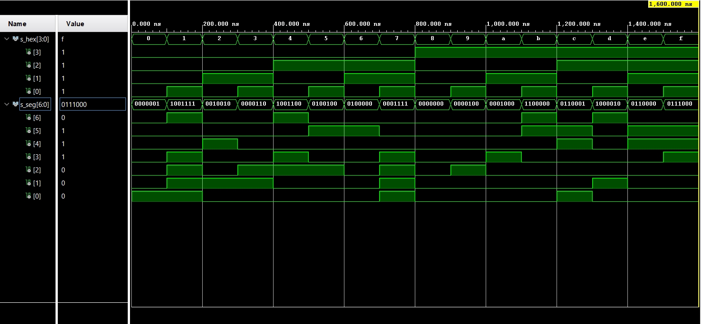

# Lab assignment


## 1 Preparation tasks

Decoder truth table for common anode 7-segment display

| Vstupný PIN | Tranzistor | **PIN** |
| :---------: | :--------: | :-----: |
|     U13     |    AN7     |   H17   |
|     K2      |    AN6     |   K15   |
|     T14     |    AN5     |   J13   |
|     P14     |    AN4     |   N14   |
|     J14     |    AN3     |   R18   |
|     T9      |    AN2     |   V17   |
|     J18     |    AN1     |   U17   |
|     J17     |    AN0     |   U16   |

| Výstupný PIN | **Rezistor** |
| :----------: | :----------: |
|     T10      |    CA, CB    |
|     R10      |    CC, CD    |
|     K16      |    CE, CF    |
|     K13      |    CG, DP    |
|     P15      |    CA, CB    |
|     T11      |    CC, CD    |
|     L18      |    CE, CF    |
|     H15      |    CG, DP    |

Figure or table with connection of 7-segment displays on Nexys A7 board 

| **Switch** | **PIN** | **LED**  | **PIN** |
| :--------: | :-----: | :--: | :-----: |
|     0      |   J15   |  0   |   H17   |
|     1      |   L16   |  1   |   K15   |
|     2      |   M13   |  2   |   J13   |
|     3      |   R15   |  3   |   N14   |
|     4      |   R17   |  4   |   R18   |
|     5      |   T18   |  5   |   V17   |
|     6      |   U18   |  6   |   U17   |
|     7      |   R13   |  7   |   U16   |
|     8      |   T8    |  8   |   V16   |
|     9      |   U8    |  9   |   T15   |
|     10     |   R16   |  10  |   U14   |
|     11     |   T13   |  11  |   T16   |
|     12     |   H6    |  12  |   V15   |
|     13     |   U12   |  13  |   V14   |
|     14     |   U11   |  14  |   V12   |
|     15     |   V10   |  15  |   V11   |

Decoder truth table for common anode 7-segment display

| Hex  | Inputs |  **A**   | **B** | **C** | **D** | **E** | **F** | **G** |
| :--: | :----: | :---: | :---: | :---: | :---: | :---: | :---: | :---: |
|  0   |  0000  |  0   |   0   |   0   |   0   |   0   |   0   |   1   |
|  1   |  0001  |  1   |   0   |   0   |   1   |   1   |   1   |   1   |
|  2   |  0010  |  0   |   0   |   1   |   0   |   0   |   1   |   0   |
|  3   |  0011  |  0   |   0   |   0   |   0   |   1   |   1   |   0   |
|  4   |  0100  |  1   |   0   |   0   |   1   |   1   |   0   |   0   |
|  5   |  0101  |  0   |   1   |   0   |   0   |   1   |   0   |   0   |
|  6   |  0110  |  0   |   1   |   0   |   0   |   0   |   0   |   0   |
|  7   |  0111  |  0   |   0   |   0   |   1   |   1   |   1   |   1   |
|  8   |  1000  |  0   |   0   |   0   |   0   |   0   |   0   |   0   |
|  9   |  1001  |  0   |   0   |   0   |   0   |   1   |   0   |   0   |
|  A   |  1010  |  0   |   0   |   0   |   1   |   0   |   0   |   0   |
|  b   |  1011  |  1   |   1   |   0   |   0   |   0   |   0   |   0   |
|  C   |  1100  |  0   |   1   |   1   |   0   |   0   |   0   |   1   |
|  d   |  1101  |  1   |   0   |   0   |   0   |   0   |   1   |   0   |
|  E   |  1110  |  0   |   1   |   1   |   0   |   0   |   0   |   0   |
|  F   |  1111  |  0   |   1   |   1   |   1   |   0   |   0   |   0   |


## 2 Seven-segment display decoder

Listing of VHDL architecture from source file `hex_7seg.vhd` with syntax highlighting

```vhdl
p_7seg_decoder : process(hex_i)
    begin
        case hex_i is
            when "0000" =>
                seg_o <= "0000001";     -- 0
            when "0001" =>
                seg_o <= "1001111";     -- 1
            when "0010" =>
                seg_o <= "0010010";     -- 2
            when "0011" =>
                seg_o <= "0000110";     -- 3
            when "0100" =>
                seg_o <= "1001100";     -- 4
            when "0101" =>
                seg_o <= "0100100";     -- 5
            when "0110" =>
                seg_o <= "0100000";     -- 6
            when "0111" =>
                seg_o <= "0001111";     -- 7
            when "1000" =>
                seg_o <= "0000000";     -- 8
            when "1001" =>
                seg_o <= "0000100";     -- 9
            when "1010" =>
                seg_o <= "0001000";     -- A
            when "1011" =>
                seg_o <= "1100000";     -- b
            when "1100" =>
                seg_o <= "0110001";     -- C
            when "1101" =>
                seg_o <= "1000010";     -- d
            when "1110" =>
                seg_o <= "0110000";     -- E
            when others =>
                seg_o <= "0111000";     -- F
        end case;
    end process p_7seg_decoder;
```
Listing of VHDL stimulus process from testbench file `tb_hex_7seg.vhd` with syntax highlighting

```vhdl
 p_stimulus : process
    begin
        -- Report a note at the begining of stimulus process
        report "Stimulus process started" severity note;

        s_hex <= "0000"; wait for 100 ns;
        s_hex <= "0001"; wait for 100 ns;
        s_hex <= "0010"; wait for 100 ns;
        s_hex <= "0011"; wait for 100 ns;
        s_hex <= "0100"; wait for 100 ns;
        s_hex <= "0101"; wait for 100 ns;
        s_hex <= "0110"; wait for 100 ns;
        s_hex <= "0111"; wait for 100 ns;
        s_hex <= "1000"; wait for 100 ns;
        s_hex <= "1001"; wait for 100 ns;
        s_hex <= "1100"; wait for 100 ns;
        s_hex <= "1101"; wait for 100 ns;
        s_hex <= "1110"; wait for 100 ns;
        s_hex <= "1111"; wait for 100 ns;
        report "Hotovo" severity note;
        wait;
end process p_stimulus;
```
Screenshot with simulated time waveforms; always display all inputs and output



Listing of VHDL code from source file `top.vhd` with 7-segment module instantiation

```vhdl
hex2seg : entity work.hex_7seg
        port map(
            hex_i => SW,
            seg_o(6) => CA,
            seg_o(5) => CB,
            seg_o(4) => CC,
            seg_o(3) => CD,
            seg_o(2) => CE,
            seg_o(1) => CF,
            seg_o(0) => CG
        );
```

## 3 LED(7:4) indicators

Truth table and listing of VHDL code for LEDs(7:4) with syntax highlighting

  ```vhdl
    -- Turn LED(4) on if input value is equal to 0, ie "0000"
    LED(4) <= '0' when(SW = "0000"); 
    
    -- Turn LED(5) on if input value is greater than 9
    LED(5) <= '0' when(SW > "1001");
    
    -- Turn LED(6) on if input value is odd, ie 1, 3, 5, ...
    LED(6) <=   '0' when (SW = "0000") else
                '0' when (SW = "0010") else
                '0' when (SW = "0100") else
                '0' when (SW = "0110") else
                '0' when (SW = "1000") else
                '0' when (SW = "1010") else
                '0' when (SW = "1100") else
                '0' when (SW = "1110");
    
    -- Turn LED(7) on if input value is a power of two, ie 1, 2, 4, or 8
    LED(7) <=   '0' when (SW = "0001") else
                '0' when (SW = "0010") else
                '0' when (SW = "0100") else
                '0' when (SW = "1000");
  ```

| Hex  | **PIN** | LED4 | LED5 | LED6 | LED7 |
| :--: | :-----: | :--: | :--: | :--: | :--: |
|  0   |  0000   |  1   |  0   |  0   |  0   |
|  1   |  0001   |  0   |  0   |  1   |  0   |
|  2   |  0010   |  0   |  0   |  0   |  1   |
|  3   |  0011   |  0   |  0   |  1   |  0   |
|  4   |  0100   |  0   |  0   |  0   |  1   |
|  5   |  0101   |  0   |  0   |  1   |  0   |
|  6   |  0110   |  0   |  0   |  0   |  0   |
|  7   |  0111   |  0   |  0   |  1   |  0   |
|  8   |  1000   |  0   |  0   |  0   |  1   |
|  9   |  1001   |  0   |  0   |  1   |  0   |
|  A   |  1010   |  0   |  1   |  0   |  0   |
|  b   |  1011   |  0   |  1   |  1   |  0   |
|  C   |  1100   |  0   |  1   |  0   |  0   |
|  d   |  1101   |  0   |  1   |  1   |  0   |
|  E   |  1110   |  0   |  1   |  0   |  0   |
|  F   |  1111   |  0   |  1   |  1   |  0   |

