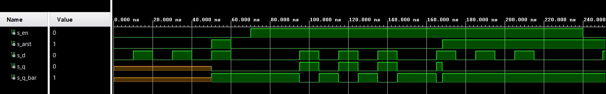
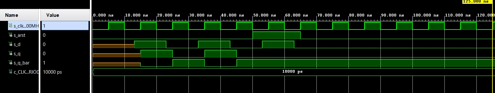
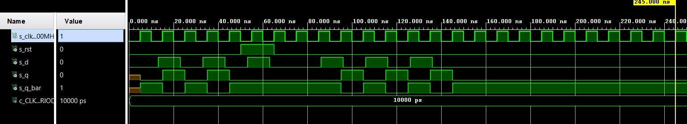
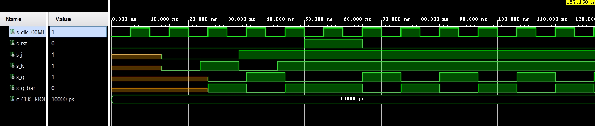
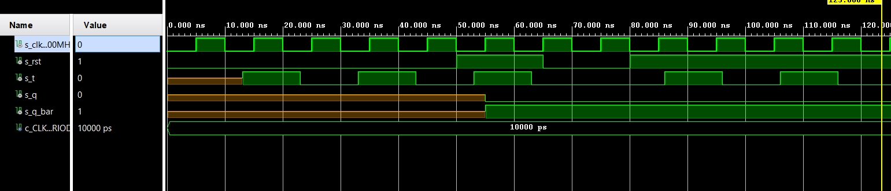
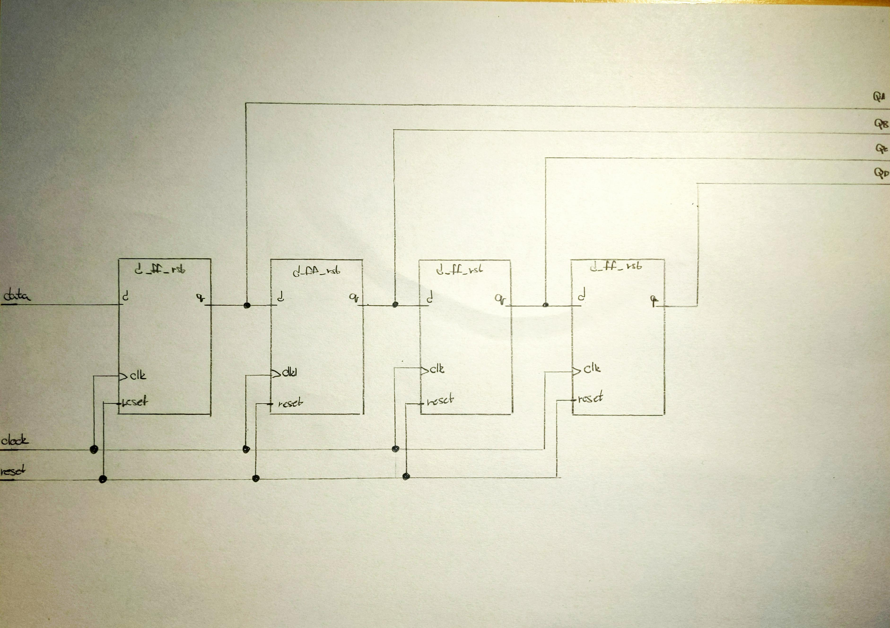

# Lab assignment


## 1 Preparation tasks

Characteristic equations and completed tables for D, JK, T flip-flops.

q_(n+1})^D = d

|  D   |  Qn  | Q(n+1) | Comments  |
| :--: | :--: | :----: | :-------: |
|  0   |  0   |   0    | No charge |
|  0   |  1   |   0    |   Reset   |
|  1   |  0   |   1    | No charge |
|  1   |  1   |   1    |    Set    |

q_(n+1)^{JK} = j*/qn + /k*qn
|  J   |  K   |  Qn  | Q(n+1) | Comments  |
| :--: | :--: | :--: | :----: | :-------: |
|  0   |  0   |  0   |   0    | No charge |
|  0   |  0   |  1   |   1    | No charge |
|  0   |  1   |  0   |   0    |   Reset   |
|  0   |  1   |  1   |   0    |   Reset   |
|  1   |  0   |  0   |   1    |    Set    |
|  1   |  0   |  1   |   1    |    Set    |
|  1   |  1   |  0   |   1    |   Togle   |
|  1   |  1   |  1   |   0    |   Togle   |

q_(n+1)^T = t*/qn + /t*qn
| T    | Qn   | Q(n+1) | Comments  |
| ---- | ---- | ------ | --------- |
| 0    | 0    | 0      | No charge |
| 0    | 1    | 1      | No charge |
| 1    | 0    | 1      | Togle     |
| 1    | 1    | 0      | Togle     |


## 2 D latch

VHDL code listing of the process `p_d_latch`

```vhdl
p_d_latch : process (d, arst, en)
begin
    if (arst = '1') then
        q     <= '0';
        q_bar <= '1';
    elsif (en = '1') then
        q     <= d;
        q_bar <= not d;
    end if;
end process p_d_latch;
```
Listing of VHDL reset and stimulus processes from the testbench `tb_d_latch.vhd`

```vhdl
p_reset_gen : process
    begin
        s_arst <= '0';
        wait for 50 ns;
        
        s_arst <= '1';
        wait for 10 ns;
        
        s_arst <= '0';
        wait for 108 ns;
        
        s_arst <= '1';
        
        wait;
    end process p_reset_gen;
  

   p_stimulus : process
    begin
        report "Stimulus process started" severity note;
        
        s_en <= '0';
        s_d  <= '0';
        
        wait for 10 ns;
        s_d  <= '1';
        wait for 10 ns;
        s_d  <= '0';
        wait for 10 ns;
        s_d  <= '1';
        wait for 10 ns;
        s_d  <= '0';
        wait for 10 ns;
        s_d  <= '1';
        wait for 10 ns;
        s_d  <= '0';
        wait for 10 ns;
        --d sequence
        
        s_en <= '1';
        wait for 15 ns;
        assert(s_q = '0' and s_q_bar = '1')
        report "Chyba" severity error;
        
        wait for 10 ns;
        s_d  <= '1';
        wait for 10 ns;
        s_d  <= '0';
        wait for 10 ns;
        s_d  <= '1';
        wait for 10 ns;
        s_d  <= '0';
        wait for 10 ns;
        s_d  <= '1';
        wait for 10 ns;
        s_d  <= '0';
        wait for 10 ns;
        --d sequence
        
        wait for 10 ns;
        s_d  <= '1';
        wait for 10 ns;
        s_d  <= '0';
        wait for 10 ns;
        s_d  <= '1';
        wait for 10 ns;
        s_d  <= '0';
        wait for 10 ns;
        s_d  <= '1';
        wait for 10 ns;
        s_d  <= '0';
        wait for 10 ns;
        
        wait for 15 ns;
        assert(s_q = '1' and s_q_bar = '1')
        report "Chyba" severity error;
        
        s_en <= '0';
        
        wait for 10 ns;
        s_d  <= '1';
        wait for 10 ns;
        s_d  <= '0';
        wait for 10 ns;
        s_d  <= '1';
        wait for 10 ns;
        s_d  <= '0';
        wait for 10 ns;
        s_d  <= '1';
        wait for 10 ns;
        s_d  <= '0';
        wait for 10 ns;
        
        s_en <= '1';
        
        wait for 10 ns;
        s_d  <= '1';
        wait for 10 ns;
        s_d  <= '0';
        wait for 10 ns;
        s_d  <= '1';
        wait for 10 ns;
        s_d  <= '0';
        wait for 10 ns;
        s_d  <= '1';
        wait for 10 ns;
        s_d  <= '0';
        wait for 10 ns;
        --d sequence
        report "Stimulus process finished" severity note;
        wait;
    end process p_stimulus;
```
Screenshot with simulated time waveforms; always display all inputs and outputs



## 3 Flip-flops

VHDL code listing of the processes `p_d_ff_arst` 

```vhdl
p_d_ff_arst : process (clk, arst)
begin
    if (arst = '1') then
        q     <= '0';
        q_bar <= '1';
    elsif rising_edge (clk) then
        q     <= d;
        q_bar <= not d;
    end if;
end process p_d_ff_arst;
```

VHDL code listing of the processes `p_d_ff_rst`

```vhdl
    p_d_ff_rst : process (clk)
    begin
        if rising_edge(clk) then
            if (rst = '1') then
                q     <= '0';
                q_bar <= '1';
            else
                q     <= d;
                q_bar <= not d;
            end if;
        end if;
        
    end process p_d_ff_rst;```vhdl
```

VHDL code listing of the processes `p_jk_ff_rst`

```vhdl
p_jk_ff_rst : process (clk)
begin
    if rising_edge(clk) then
        if (rst = '1') then
            s_q <= '0';
        else
            if (j = '0' and k = '0') then
                s_q <= s_q;
            elsif (j = '0' and k = '1') then
                s_q <= '0';
            elsif (j = '1' and k = '0') then
                s_q <= '1';
            elsif (j = '1' and k = '1') then
                s_q <= not s_q;
            
            end if;
        end if;
    end if;

end process p_jk_ff_rst;
```

VHDL code listing of the processes  `p_t_ff_rst`

```vhdl
p_t_ff_rst : process (clk)
begin
    if rising_edge(clk) then
        if (rst = '1') then
            s_q <= '0';
        elsif (t = '1') then
            s_q <= not s_q;
        elsif (t = '0') then
            s_q <= s_q;
            
        end if;
    end if;

end process p_t_ff_rst;
```

Listing of VHDL clock, reset and stimulus processes from the testbench files with syntax highlighting and asserts `p_d_ff_arst`

```vhdl
    p_reset_gen : process
    begin
        s_arst <= '0';
        wait for 50 ns;
        
        s_arst <= '1';
        wait for 15 ns;
        
        s_arst <= '0';
        
        wait;
    end process p_reset_gen;
    
    p_stimulus : process
    begin
        report "Stimulus process started" severity note;
        assert(s_q = '0' and s_q_bar = '1')
        report "Chyba" severity error; 
        
        wait for 13 ns;
        s_d  <= '1';
        wait for 10 ns;
        s_d  <= '0';
        wait for 10 ns;
        s_d  <= '1';
        wait for 10 ns;
        s_d  <= '0';
        wait for 10 ns;
        s_d  <= '1';
        wait for 10 ns;
        s_d  <= '0';
        wait for 10 ns;
        
        report "Stimulus process finished" severity note;
        wait;
    end process p_stimulus;
```

Listing of VHDL clock, reset and stimulus processes from the testbench files with syntax highlighting and asserts `p_d_ff_rst`

```vhdl
    p_clk_gen : process
    begin
        while now < 750 ns loop          
            s_clk_100MHz <= '0';
            wait for c_CLK_100MHZ_PERIOD / 2;
            s_clk_100MHz <= '1';
            wait for c_CLK_100MHZ_PERIOD / 2;
        end loop;
        wait;
    end process p_clk_gen;
    
    p_reset_gen : process
    begin
        s_rst <= '0';
        wait for 50 ns;
        
        s_rst <= '1';
        wait for 15 ns;
        
        s_rst <= '0';
        
        wait;
    end process p_reset_gen;
    
    p_stimulus : process
    begin
        report "Stimulus process started" severity note;
        
        s_d  <= '0';
        
	    wait for 13 ns;
        s_d  <= '1';
        wait for 10 ns;
        s_d  <= '0';
        wait for 10 ns;
        s_d  <= '1';
        wait for 10 ns;
        s_d  <= '0';
        wait for 10 ns;
        s_d  <= '1';
        wait for 10 ns;
        s_d  <= '0';
        wait for 10 ns;
	    assert(s_q = '0' and s_q_bar = '1')
        report "Chyba" severity error;
        
        wait for 13 ns;
        s_d  <= '1';
        wait for 10 ns;
        s_d  <= '0';
        wait for 10 ns;
        s_d  <= '1';
        wait for 10 ns;
        s_d  <= '0';
        wait for 10 ns;
        s_d  <= '1';
        wait for 10 ns;
        s_d  <= '0';
        wait for 10 ns;
	    assert(s_q = '0' and s_q_bar = '1')
        report "Chyba" severity error; 
        
        report "Stimulus process finished" severity note;
        wait;
    end process p_stimulus;
```

Listing of VHDL clock, reset and stimulus processes from the testbench files with syntax highlighting and asserts `p_jk_ff_rst`

```vhdl
    p_reset_gen : process
    begin
        s_rst <= '0';
        wait for 50 ns;
        
        s_rst <= '1';
        wait for 15 ns;
        
        s_rst <= '0';
        
        wait;
    end process p_reset_gen;
    
    p_stimulus : process
    begin
        report "Stimulus process started" severity note;
        
	    wait for 13 ns;
        s_j  <= '0';
        s_k  <= '0';
        wait for 10 ns;
        s_j  <= '0';
        s_k  <= '1';
        wait for 10 ns;
        s_j  <= '1';
        s_k  <= '0';
        wait for 10 ns;
        s_j  <= '1';
        s_k  <= '1';
        wait for 10 ns;
        s_j  <= '1';
        s_k  <= '1';
        wait for 10 ns;
        s_j  <= '1';
        s_k  <= '1';
	    assert(s_q = '0' and s_q_bar = '1')
        report "Chyba" severity error;
        
        report "Stimulus process finished" severity note;
        wait;
    end process p_stimulus;
```

Listing of VHDL clock, reset and stimulus processes from the testbench files with syntax highlighting and asserts `p_t_ff_rst`

```vhdl
    p_reset_gen : process
    begin
        s_rst <= '0';
        wait for 50 ns;
        
        s_rst <= '1';
        wait for 15 ns;
        
        s_rst <= '0';
        wait for 15 ns;
        
        s_rst <= '1';
        wait for 50 ns;
        
        s_rst <= '0';        
        
        wait;
    end process p_reset_gen;
    
    p_stimulus : process
    begin
        report "Stimulus process started" severity note;
        
	    wait for 13 ns;
        s_t  <= '1';
        wait for 10 ns;
        s_t  <= '0';
        wait for 10 ns;
        s_t  <= '1';
        wait for 10 ns;
        s_t  <= '0';
        wait for 10 ns;
        s_t  <= '1';
        wait for 10 ns;
        s_t  <= '0';
        wait for 10 ns;
	    assert(s_q = '0' and s_q_bar = '1')
        report "Chyba" severity error;
        
        wait for 13 ns;
        s_t  <= '1';
        wait for 10 ns;
        s_t  <= '0';
        wait for 10 ns;
        s_t  <= '1';
        wait for 10 ns;
        s_t  <= '0';
        wait for 10 ns;
        s_t  <= '1';
        wait for 10 ns;
        s_t  <= '0';
        wait for 10 ns;
        
        report "Stimulus process finished" severity note;
        wait;
    end process p_stimulus;
```

Screenshot with simulated time waveforms; always display all inputs and outputs `p_d_ff_arst`



Screenshot with simulated time waveforms; always display all inputs and outputs `p_d_ff_rst`



Screenshot with simulated time waveforms; always display all inputs and outputs `p_jk_ff_rst`



Screenshot with simulated time waveforms; always display all inputs and outputs `p_t_ff_rst`



## 4 Shift register

Image of the shift register schematic. The image can be drawn on a computer or by hand. Name all inputs, outputs, components and internal signals

